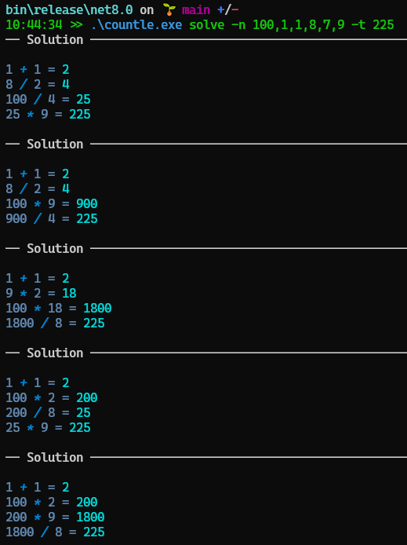

## Countle
Countle is a variation of the popular Wordle game, just with numbers and arithmetic operations. You can play it [here](https://www.countle.org/). 

You start with six integers, and your goal is to produce a given target number by basic arithmetic operations.
On each turn, you pick two of the numbers and an operation +, -, *, /. If the result equals the target, you're done, but if not, you can continue with the next turn. The numbers used in the previous moves are not available anymore, however, the result of the previous operation is!

E.g., given 1, 3, 4, 10, 21, 102 and goal number 1008, a solution in 4 moves is:

* 10   * 102 = 1020
* 1020 -  21 = 1001
* 3    +   4 = 7
* 1001 +   7 = 1008

## Countle Solver
That Sounds like a game that can be solved computationally ... in comes the countle-solver.

This is an example of a usage:
```PS
.\Countle.exe solve -n 1,3,4,10,21,102 -t 1008 -m 5
````
Here, via the parameter 
* `(-n|--numbers)` one provides the numbers that can be used. They have to be comma-separated integers, and are not restricted to six as in the original game.
* `(-t|--target)` one provides the target number.
* `(-m|--maxSolutions)` one can, optionally, limit the solutions. The solutions are ordered ascending by the number of turns.

## Sample
Here is the countle solver in action on the official puzzle from the 13th of September 2022. In the screenshot, the first two solutions are essentially the same (they just differ in the order of independent turns), whereas the third solution is different (it is also cut off there as it shows more variations of the same solutions below). 



Eliminating the 'same solutions' would be the next step, and interesting for the sake of determining all 'unique' solutions to a puzzle. 

## Feedback and Contributing
All feedback welcome!
All contributions are welcome!
